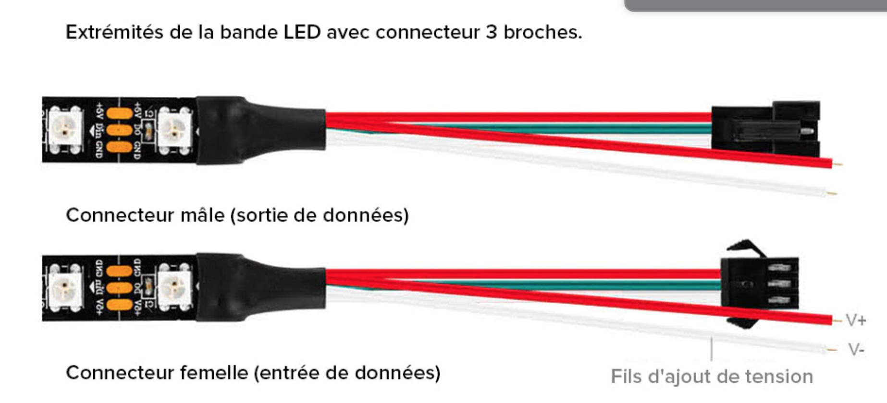
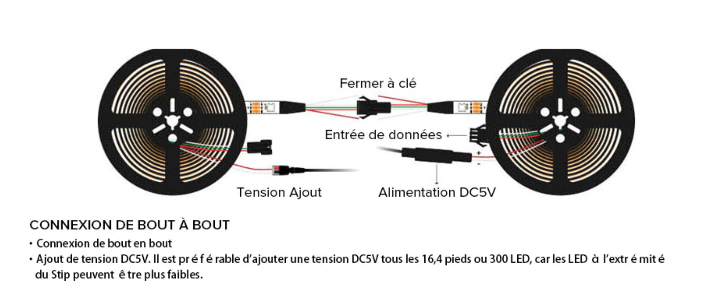
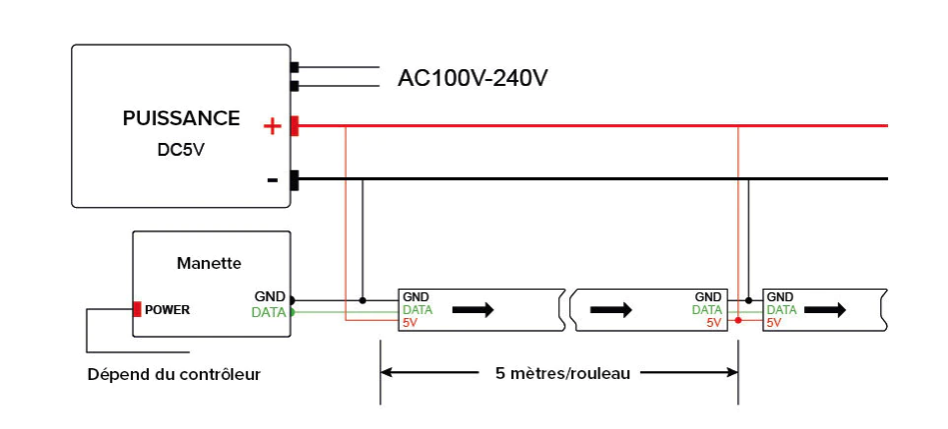

********************************
matelec-ESP8266-NeoPixel-WS2812B
********************************

Sources documentaires:
 * https://docs.micropython.org/en/latest/library/neopixel.html
 * https://docs.micropython.org/en/latest/esp8266/quickref.html#neopixel-driver
 * https://github.com/mchobby/esp8266-upy/tree/master/neopixel

Matériels:
  * https://fr.aliexpress.com/item/2036819167.html?spm=a2g0o.store_pc_groupList.8148356.5.590457b153hkTO&pdp_npi=2%40dis%21EUR%21€%205%2C43%21€%200%2C17%21%21%21%21%21%4021038ed816723902213446457e856a%2112000026548380063%21sh

La bibliothèque neopixel incluse dans le firmware microPython prend en charge les bandeaux, anneaux et matrices NeoPixel

--------------------
script python n°1:
--------------------
Il permet d'allumer un NeoPixels en définissant la couleur.

.. literalinclude:: ./code/exemple_neopixel_01.py

--------------------
script python n°2
--------------------
Il permet d'allumer la totalité des Neopixels en définissant la couleur.

.. literalinclude:: ./code/exemple_neopixel_02.py

-------------------
script python n°3
-------------------
Il permet d'éteindre les Néopixels.

.. literalinclude:: ./code/exemple_neopixel_03.py

-------------------
Exemples d'effets lumineux
-------------------
Dans le script il y a plusieurs fonctions d'effets lumineux utilisables dans des IoT de gestion de Neopixels

.. literalinclude:: ./code/fxdemo.py

-------------------
Applications
-------------------

Connecteur
---------

Connexion
---------

Cablâge
---------

Consommation électrique
------------------------
 les bandeaux 30 leds/m ont une consommation de 9W/m sous 5VDC.

 les bandeaux 60 leds/m ont une consommation de 18W/m sous 5VDC.

 1px= 0,3W sois 60mA
